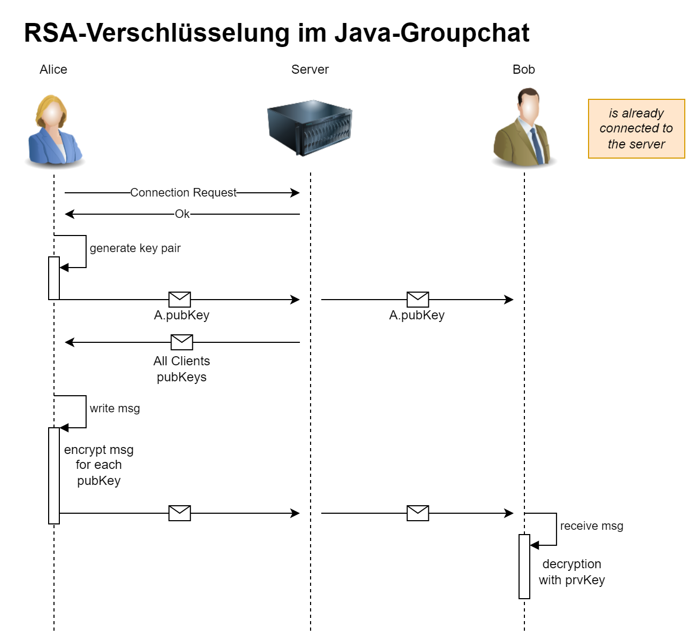

# Konsolenbasierte & verschlüsselter Gruppenchat in Java

## Meta

**Projektname:** Konsolenbasierte & verschlüsselter Gruppenchat in Java

**Modul:**
Verteilte Systeme, Semester 6, DHBW Karlsruhe

**Projektmitglieder:**

- Robin Pfaff ()
- Niklas Trenz ()

**GitHub Link:** [GitHub java-group-chat](https://github.com/robin13901/java-group-chat)

## Projekt Beschreibung

> Besonderes Augenmerk auf (für 0.5 besser): Dokumentation | Verständlicher Quellcode | gute UX | Effizienz | ... -> bei uns die Verschlüsselung

<u>Anforderungen:</u>

- Konsolenbasierter Gruppenchat in Java
- Server verwaltet Nachrichten der Gruppe
- Beliebig viele Clients können sich in der Gruppe (=>Server) anmelden
- Nachrichten der Clients werden mit Namen auf der Konsole jedes Clients angezeigt

<u>Geschätzer Zeitaufwand:</u> 20 PS

### Ausführung

> Wie kann er die Software ausführen?

```shell
command to execute the software
```

### Screenshots

> Die Screenschots sollen das Programm beispielsweise darstellen

## Architektur

### Verschlüsselung

Zur Verschlüsselung der Nachrichten im Java-Groupchat wird das RSA Verfahren verwendet. Vorgehen:

1. Jeder Nutzer erzeugt für sich ein Key Pair (Public + Private)
2. Der public Key wird an den Server geschicht, welcher diesen an alle anderen Clients verteilt
3. Jeder Client hat einen KeyStore, welcher die Namen der Nutzer und deren public Keys enthält
4. Wenn ein Nutzer eine Nachricht verschickt, wird diese jeweils mit den public Keys der anderen Clients verschlüsselt
   - Eine Nachricht ist fogend aufgebaut:
        ```<name des senders> <timestamp> <name client #1> <verschlüsselte nachricht mit public key des clients #1> <name client #2> <verschlüsselte nachricht mit public key des clients #2> ...```
5. Der Server leitet dann die Nachricht an jeden Client weiter
6. Jeder Client entschlüsselt die Nachricht die für ihn verschlüsselt wurde mit seinem private Key



### Server-Client-Architektur

Die Server-Client-Architektur des Java-Groupchats ermöglicht die Kommunikation zwischen mehreren Clients über einen zentralen Server. Hier sind die Schlüsselprinzipien:

*Server-Client-Verbindungsaufbau:*
- Der Server wird gestartet und wartet auf eingehende Verbindungen von Clients.
- Clients initiieren eine Verbindung mit dem Server, um sich zu registrieren und am Gruppenchat teilzunehmen.

*Client-Registrierung:*
- Bei der Registrierung meldet sich ein Client beim Server an und sendet seine Benutzerinformationen, einschließlich Benutzername und Public Key für die Verschlüsselung.
- Der Server registriert den Client und speichert seine Benutzerinformationen für zukünftige Kommunikation.

*Schlüsselaustausch:*
- Während der Registrierung erfolgt ein Schlüsselaustausch, bei dem der Client seinen Public Key an den Server sendet. Der Server verteilt dann diesen Public Key an alle anderen Clients im Chat.
- Dies ermöglicht es jedem Client, Nachrichten sicher zu verschlüsseln, um die Privatsphäre und Sicherheit der Kommunikation zu gewährleisten.

*Nachrichtenübertragung:*
- Ein Client kann eine Nachricht an den Server senden, die dann an alle anderen Clients weitergeleitet wird.
- Die Nachricht wird mit den Public Keys der anderen Clients verschlüsselt, um sicherzustellen, dass nur die beabsichtigten Empfänger sie entschlüsseln können.

*Client-Disconnect:*
- Clients haben die Möglichkeit, sich vom Server abzumelden und die Verbindung zu beenden, wenn sie den Gruppenchat verlassen möchten.
- Der Server aktualisiert seine Liste registrierter Clients entsprechend und informiert die anderen Clients über Änderungen in der Teilnehmerliste.

Die Server-Client-Architektur ermöglicht eine effiziente und sichere Kommunikation zwischen den Teilnehmern des Groupchats, wobei der Server als Vermittler fungiert und die Nachrichtenübertragung koordiniert.
